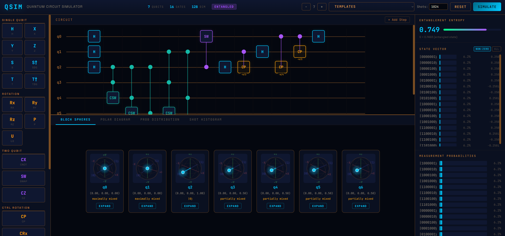

# QSIM: Quantum Circuit Simulator

I made a high quality quantum circuit simulator with a visual drag-and-drop circuit builder, interactive Bloch sphere visualization, Shor's algorithm (and many other circuit template) support, and real-time state vector analysis. Built with FastAPI, NumPy, and vanilla JavaScript.



## Features

- **Visual Circuit Builder** - Drag and drop gates onto qubit wires to build quantum circuits
- **23 Quantum Gates** - Full gate library including Toffoli, Fredkin, controlled-rotations, and U3
- **Up to 10 Qubits** - Simulate Hilbert spaces up to dimension 1024
- **Real Quantum Math** - State vector simulation using NumPy with einsum tensor contraction
- **Pre-built Algorithm Templates** - Shor's (N=15), Grover's, QFT, Teleportation, and more
- **Multi-shot Measurement** - Run circuits N times with shot histogram visualization
- **Interactive Bloch Spheres** - Per-qubit 3D Bloch sphere with drag-to-rotate and click-to-expand
- **Polar Amplitude Diagram** - Visualize state amplitudes and phases on a polar plot with zoom/pan
- **Probability Distribution** - Zoomable bar chart showing measurement probabilities
- **Entanglement Detection** - Von Neumann entropy calculation with visual status indicator
- **Rotation Gate Highlighting** - Rx, Ry, Rz gates styled in amber to indicate encoded angle information

## Installation

```bash
git clone https://github.com/yourusername/qsim.git
cd qsim
pip install -r requirements.txt
uvicorn main:app --reload
```

Open [http://localhost:8000](http://localhost:8000) in your browser.

> **Note:** Requires Python 3.10+. If using Python 3.15 alpha (no NumPy wheels), use `py -3.12 -m uvicorn main:app --reload` instead.

## Usage

1. **Add Qubits** - Use the `+`/`-` buttons in the header (1--10 qubits)
2. **Place Gates** - Drag gates from the left palette onto qubit wire slots
3. **Parameterized Gates** - Rx, Ry, Rz, CP, U3 open a parameter dialog with preset values
4. **Two/Three-Qubit Gates** - Drop CNOT, Toffoli, etc. on a qubit; they auto-connect to adjacent qubits
5. **Load Templates** - Select from the Templates dropdown to load pre-built algorithms
6. **Multi-shot Measurement** - Set Shots > 0 in the header, then simulate
7. **View Results** - Four visualization tabs: Bloch Spheres, Polar Diagram, Prob Distribution, Shot Histogram
8. **Expand Bloch Spheres** - Click "Expand" on any Bloch sphere for a large interactive view
9. **Zoom Charts** - Use the +/- controls on polar and bar charts
10. **Reset** - Press `R` or click the Reset button

## Circuit Templates

| Template | Qubits | Description |
|----------|--------|-------------|
| Bell State | 2 | Maximally entangled pair (Bell00) |
| GHZ State | 3 | 3-qubit Greenberger-Horne-Zeilinger state |
| Quantum Teleportation | 3 | Teleports q0 state to q2 via Bell pair |
| QFT (4-qubit) | 4 | Quantum Fourier Transform |
| Inverse QFT | 4 | Inverse QFT for phase extraction |
| Grover's Search | 2 | Finds \|11> with 100% probability in one iteration |
| Deutsch-Jozsa | 3 | Balanced oracle detection in single query |
| Superdense Coding | 2 | Transmits 2 classical bits via 1 qubit |
| **Shor's Algorithm (N=15)** | **7** | **Factors 15 into 3 x 5 using Fredkin gates** |

## Gate Reference

### Single Qubit
| Gate | Description |
|------|-------------|
| H | Hadamard - equal superposition |
| X, Y, Z | Pauli gates - bit flip, bit+phase flip, phase flip |
| S, S-dagger | Phase gate and its inverse (pi/2 phase) |
| T, T-dagger | pi/4 phase gate and its inverse |
| Rx(theta), Ry(theta), Rz(theta) | Rotation gates around X, Y, Z axes |
| P(theta) | Phase gate with arbitrary angle |
| U3(theta, phi, lambda) | Universal single-qubit gate |

### Two Qubit
| Gate | Description |
|------|-------------|
| CNOT | Controlled-NOT - creates entanglement |
| SWAP | Exchanges two qubit states |
| CZ | Controlled-Z - phase flip on \|11> |
| CP(theta) | Controlled-Phase - key gate for QFT |
| CRx, CRy, CRz | Controlled rotation gates |

### Three Qubit
| Gate | Description |
|------|-------------|
| Toffoli (CCX) | Flips target when both controls are \|1> |
| Fredkin (CSWAP) | Swaps two qubits when control is \|1> |
| CCZ | Phase flip on \|111> |

## API Endpoints

### `POST /simulate`
```json
{
  "num_qubits": 2,
  "circuit": [[{"gate": "H", "target": 0, "params": {}}],
              [{"gate": "CNOT", "target": 1, "control": 0, "params": {}}]],
  "shots": 1024
}
```

Returns state vector, probabilities, Bloch vectors, entanglement entropy, and optionally shot counts.

### `GET /gates`
Full gate catalogue with matrices and descriptions.

### `GET /templates`
List all available circuit templates.

### `GET /templates/{name}`
Get a specific template circuit definition.

### `GET /health`
Health check.

## Technical Approach

### State Vector Simulation
An n-qubit system is represented as a complex vector in a 2^n-dimensional Hilbert space, initialized to |0...0>.

### Gate Application (einsum)
Gates are applied via **tensor contraction** using `np.einsum`, which generalizes cleanly to any gate size (1, 2, or 3 qubits) without requiring SWAP networks:

```python
gate_tensor = gate_matrix.reshape([2]*k + [2]*k)
state_tensor = state.reshape([2]*num_qubits)
new_state = np.einsum(gate_tensor, gate_indices, state_tensor, state_indices, result_indices)
```

### Measurement
- **Born rule**: P(|x>) = |<x|psi>|^2
- **Multi-shot**: Samples from the probability distribution N times
- **Single-qubit measurement**: Collapses only the measured qubit, renormalizes

### Bloch Sphere
Each qubit's Bloch vector is extracted from its reduced density matrix:
`x = Tr(rho * sigma_x)`, `y = Tr(rho * sigma_y)`, `z = Tr(rho * sigma_z)`

### Entanglement Detection
Von Neumann entropy: `S(rho) = -Tr(rho * log2(rho))`. S=0 means separable, S=1 means maximally entangled.

### Shor's Algorithm (N=15)
The included Shor's template factors N=15 using a=2 with 3 counting qubits and 4 work qubits. Controlled modular multiplication is implemented as cyclic bit shifts via Fredkin (CSWAP) gates. The inverse QFT extracts the period r=4, yielding factors gcd(2^2-1, 15)=3 and gcd(2^2+1, 15)=5.

## Project Structure

```
qsim/
├── main.py              # FastAPI app, routes, request models
├── simulator.py         # State vector engine, measurement, Bloch, entropy
├── gates.py             # 23 gate matrix definitions (1/2/3 qubit)
├── circuit_templates.py # 9 pre-built algorithm circuits
├── requirements.txt     # fastapi, uvicorn, numpy, jinja2
├── README.md
├── LICENSE              # MIT
├── .gitignore
├── static/
│   └── style.css        # Quantum Manuscript theme
└── templates/
    └── index.html       # Full SPA frontend
```

## Author

**Trishan Biswas**

## License

[MIT License](LICENSE)
